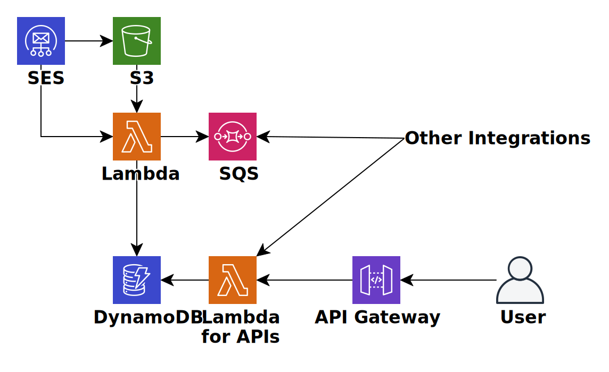

# Mailbox

[](https://github.com/harryzcy/mailbox/actions)
[](https://codecov.io/gh/harryzcy/mailbox)
[](https://goreportcard.com/report/github.com/harryzcy/mailbox)
[](http://makeapullrequest.com)
[](https://opensource.org/licenses/MIT)

Docs: [English](README.md) • [简体中文](README_zh.md)

Mailbox is a serverless application that receives emails and triggers custom events.

It runs on AWS services, including SES, Lambda, API Gateway, DynamoDB, and SQS.

## Table of Contents

* [Usage](#usage)
* [API](doc/api.md)
* [CLI](#cli)
* [Architecture](#architecture)
* [Contributing](#contributing)
* [TODOs](#todos)

## Usage

1. Clone the repository.

    ```shell
    git clone https://github.com/harryzcy/mailbox
    ```

1. Install [serverless](https://github.com/serverless/serverless).

    ```shell
    npm install -g serverless
    ```

1. Create an IAM user.

    Create an IAM user with **AdministratorAccess** and export the access key as environment variables.

    ```shell
    export AWS_ACCESS_KEY_ID=<your-key-here>
    export AWS_SECRET_ACCESS_KEY=<your-secret-key-here>
    ```

    For more details, follow [this guide](https://www.serverless.com/framework/docs/providers/aws/guide/credentials).

1. Setup AWS services.

    Manually create S3 buckets, and setup SES and SQS (optional) from AWS console.

1. Run Quick Start script to set up configurations.

    ```shell
    ./script/quickstart.sh
    ```

1. Deploy the app.

    ```shell
    make deploy
    ```

1. Configure email receiving.

    From AWS console -> Configuration -> Email receiving -> Create rule set -> Create rule, add two actions:

    1. Deliver to Amazon S3 bucket, then enter your bucket name.
    2. Invoke AWS Lambda function, and select `mailbox-dev-emailReceive` or `mailbox-prod-emailReceive`.

## API

See [doc/API.md](doc/api.md)

## CLI

Refer to [mailbox-cli](https://github.com/harryzcy/mailbox-cli)

## Architecture



## Contributing

### Development environment

* Go >= 1.17

Note that the two most recent minor versions of Go are officially supported.

Go versions newer than 1.15 may be supported, but be sure to change go version in `go.mod` since there is a behavioral change of go modules starting from version 1.17.

## TODOs

* [x] Support API access controls
* [x] Support sending emails
